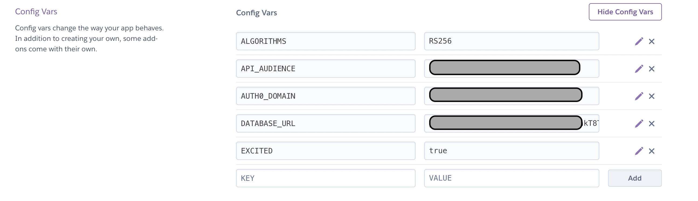

# FSND Final Project

## Gourmet App
As a foreigner living in the country, who also likes delicious food, I often have problems choosing a snack or the right cooking ingredient in front of numorous options. As a result, I developed this app that gathers comments from consumers to help people like me find the right food they want.
Gourmet App is used to display various kinds of items by categories, as with comments from consumers. The application function includes:
1. Display item. An item should have its' brand, category and comment from consumers
2. Update item
3. Delete item

## APIs
GET `'/categories'`
- Fetches a dictionary of categories in which the keys are the ids and the value is the corresponding string of the category
- Request Arguments: None
- Returns: An object with a single key, categories, that contains an object of id: category_string key: value pairs.
- Example:
```bash
{
    "1": "Chips",
    "2": "Cookies",
    "3": "Dried Fruits",
    "4": "Popcorn",
    "5": "Pretzels"
}
```

GET `'/items'`
- Fetches all items in database with id as key
- Request Arguments: None
- Returns: A list of items with id, title, brand, category and comment
- Example:
```bash
"items": [
        {
            "brand": "belVita",
            "category": 2,
            "comment": "Perfect for Breakfast on the Go",
            "id": 2,
            "title": "Cranberry Orange Breakfast Biscuits"
        }
]
```

DELETE `'/items/<int:item_id>'`
- Delete the item with the given item_id from database
- Request Arguments: `item_id`
- Returns: The deleted item with id, title, brand, category and comment
- Example:
```bash
"items": [
        {
            "brand": "belVita",
            "category": 2,
            "comment": "Perfect for Breakfast on the Go",
            "id": 2,
            "title": "Cranberry Orange Breakfast Biscuits"
        }
]
```

PATCH `'/items/<int:item_id>'`
- Update the item with the given item_id
- Request Arguments: `item_id`
- Returns: The updated item with id, title, brand, category and comment
- Example:
```bash
"items": [
        {
            "brand": "belVita",
            "category": 2,
            "comment": "Perfect for Breakfast on the Go",
            "id": 2,
            "title": "Cranberry Orange Breakfast Biscuits"
        }
]
```

## Roles
VISITOR
- Permissions: GET `'/categories'`, GET `'/items'`

ADMIN
- Permissions: GET `'/categories'`, GET `'/items'`, DELETE `'/items/<int:item_id>'`, PATCH `'/items/<int:item_id>'`


# Backend - Gourmet App

## Setting up the Backend

### Install Dependencies

1. **Python 3.9** - Follow instructions to install the latest version of python for your platform in the [python docs](https://docs.python.org/3/using/unix.html#getting-and-installing-the-latest-version-of-python)

2. **Virtual Environment** - We recommend working within a virtual environment whenever using Python for projects. This keeps your dependencies for each project separate and organized. Instructions for setting up a virual environment for your platform can be found in the [python docs](https://packaging.python.org/guides/installing-using-pip-and-virtual-environments/)

3. **PIP Dependencies** - Once your virtual environment is setup and running, install the required dependencies by navigating to the `/backend` directory and running:

```bash
pip3 install -r requirements.txt
```

#### Key Pip Dependencies

- [Flask](http://flask.pocoo.org/) is a lightweight backend microservices framework. Flask is required to handle requests and responses.

- [SQLAlchemy](https://www.sqlalchemy.org/) is the Python SQL toolkit and ORM we'll use to handle the lightweight SQL database. You'll primarily work in `app.py`and can reference `models.py`.

- [python-jose](https://pypi.org/project/python-jose/) The JavaScript Object Signing and Encryption (JOSE) technologies can be used to encrypt and/or sign content using a variety of algorithms. You'll primarily work in `auth.py` with `jwt` provided by `python-jose`. Please avoid using `python-jose-cryptodome` because it's not compatible to heroku's python environment.


### Set up the Database

With Postgres running, create a `fsnd` database:

```bash
createdb fsnd
```

Populate the database using the `fsnd.psql` file provided. From the `backend` folder in terminal run:

```bash
export DATABASE_URL=postgresql://localhost:5432/fsnd
psql "$DATABASE_URL" < fsnd.psql
```

### Run the Server

From within the `backend` folder first ensure you are working using your created virtual environment.

To run the server, execute:

```bash
FLASK_APP=app.py FLASK_DEBUG=True flask run
```

## Testing
Write at least one test for the success and at least one error behavior of each endpoint using the unittest library.

To deploy the tests, run
```bash
dropdb fsnd_test
createdb fsnd_test
psql fsnd_test < fsnd.psql
python test_fsnd.py
```


### Deploy on Heroku

1. **Create a new app**
```bash
heroku create -a heroksp
# For example, 
# heroku create myapp-663697908 --buildpack heroku/python
# https://myapp-663697908.herokuapp.com/ | https://git.heroku.com/myapp-663697908.git
```
This returns a `[heroku_remote_git_url]` which could be used in the next step.

2. **Set up database**
Create a database using `bit.io` and save the database url. Initiate databse using psql.

3. **Set up environment variable**
 Go to your Heroku Dashboard in the browser and access your application's settings. You will have to go to the Heroku dashboard >> Particular App >> Settings >> Reveal Config Vars section to add and set up variables.


4. **Deploy**
* Clone this repository
* Add Heroku remote
```bash
git remote add heroku [heroku_remote_git_url]
```
* Push to heroku to trigger automatical build
```bash
git push heroku main
```

